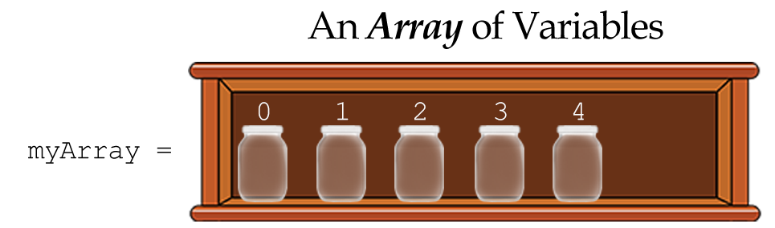
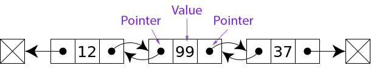

# Review: Arrays

###### ICS4U - This is a review and lesson. [Click here to go back to the README](../README.md).

The most basic _abstract_ data type is the `Array`. Not all programming languages have them and they can create havoc in the memory of the computer.

# Arrays

Think of an array like a shelf of jars where each jar is an _indexed_ variable:



While [arrays](https://www.w3schools.com/js/js_arrays.asp) are a grade 11 topic, it is important to understand that they are a critical data structure that is not native to all programming languages.

The [Array](https://www.w3schools.com/js/js_arrays.asp) is an _abstract data type_ that JavaScript implements as a doubly-linked list.



JavaScript is a _[loosely typed language](https://www.computerhope.com/jargon/l/looslang.htm)_. An Array can hold any combination of data types - text, numbers, etc...
<br>Not so in _strongly typed languages_ like C, C++, Java, etc... 

Today we will ensure that we understand everything we can about working with arrays. w3schools has a [very complete reference on Arrays in JavaScript](https://www.w3schools.com/jsref/jsref_obj_array.asp).

<br>

---

### Read through these topics below
#### You might just learn something.

- [Creating Arrays](#creating-arrays)
- [Destroying Arrays](#destroying-arrays)
- [Adding & Removing Elements](#adding-and-removing-elements)
- [Looping through Arrays](#looping-through-arrays) ("iterating")
- [Copying Arrays and Passing Arrays to Functions](#copying-arrays-and-passing-arrays-to-functions)
- [Useful Array Functions](#useful-functions)


# Creating Arrays

There are two ways to make a new array:
```JS
let points = [];  // Empty array
let marks = [45, 66, 50, 87]; // array with 4 specific items

let words = new Array(); // empty array
let games = new Array(6); // 6-item array of 'undefined' in each
```

There are some functions that `return` arrays. It's important to know that these are new copies and the original array has not been touched. However, when you pass arrays into a function it is done by _reference_. Read through the tutorial for an example of this.

# Destroying Arrays

If you want to empty an array it's as simple as assigning it to a new, empty array.
```JS
marks = [];

// or

marks = new Array();
```
###### [Back to top](#arrays)

# Adding and Removing Elements
To add the the _end_: `arr.push(item)`

You can add at any index you want, _but this can create holes_:
```JS
let arr = [3,6];
arr[5] = 9;
// arr: [3,6,undefined,undefined,undefined,9]
```

To remove from the _end_: `arr.pop()`

To [remove at a specific index](https://www.w3schools.com/jsref/jsref_splice.asp): `arr.splice(index, how_many)`
```JS
let arr = ["car","boat","house","banana","monkey"];
arr.splice(1,2);  // Remove "boat" and "house"
```
**Note:** Do not confuse [splice( )](https://www.w3schools.com/jsref/jsref_splice.asp) with [slice( )](https://www.w3schools.com/jsref/jsref_slice_array.asp)

###### [Back to top](#arrays)

# Looping Through Arrays
## Iterating

When you loop through an array, this is called _iterating_ where each loop is a single _iteration_. You can even use and create _iterators_, but that's for later.

The classic iteration is a for-loop:
```JS
let arr = [3,5,4,3,6,7,6,5,2,1,3,4]
for (let x = 0; x < arr.length; x++) {
  // Do something with arr[x]
}
```
In JavaScript there is the `in` shortcut:
```JS
for (let x in arr) {
  // x is the address, arr[x] is the element
  console.log("Element", x, "is", arr[x]);
}
```

There's also the `of` shortcut:
```JS
for (let x of arr) {
  // x will be the actual element in arr
  console.log(x);
}
```

### Examples:
```JS
let my_array = ["A", "B", "C", "D"];

for (let i in my_array) 
  console.log(i, my_array[i]);

// Output:
0 A
1 B
2 C
3 D
```

```JS
let my_array = ["A", "B", "C", "D"];

for (let i of my_array) 
  console.log(i);

// Output:
A
B
C
D
```
###### [Back to top](#arrays)

# Copying Arrays and Passing Arrays to Functions

Imagine passing an array of 99 billion elements to multiple functions. This would cause a great deal of stress on the memory and the processor. For this reason, arrays are passed _by reference_. This means a _**pointer**_ to the array is passed to the function.

The same goes for making copies. **Let's look at an example:**
```JS
// Farm animals are cute
let animals = ['🐩', '🦌', '🐄', '🐏', '🐏', '🐏'];

// Make a copy and add a wolf to the copy
let array2 = animals;
array2.push('🐺');

// Let's see what we get
console.log("1:  " + animals);
console.log("2:  " + array2);

// Output:
1: 🐩,🦌,🐄,🐏,🐏,🐏,🐺
2: 🐩,🦌,🐄,🐏,🐏,🐏,🐺
```

In the above example, the wolf was placed in _both_ arrays! But really that's a lie. There's only one array. The variables `animals` and `array2` both _point_ to the same memory space - to the same array.

How about passing an array to a function:
```JS
// Farm animals are still cute
let animals = ['🐩', '🦌', '🐄', '🐏', '🐏', '🐏'];

do_stuff(animals);

console.log(animals);

function do_stuff(passed_array) {
  let copy_of_array = passed_array;
  copy_of_array.fill('🐺');
}

// Output:
["🐺", "🐺", "🐺", "🐺", "🐺", "🐺"]

```

Notice that the function _modified the original array_. This is not always good.

###### [Back to top](#arrays)

# Duplicating an Array
If you want to make a duplicate of an array, [it's not that simple](https://www.freecodecamp.org/news/how-to-clone-an-array-in-javascript-1d3183468f6a/). The short answer is to use `Array.from()`:

```JS
numbers = [1, 2, 3];
numbersCopy = Array.from(numbers);
// [1, 2, 3]
```

But if your array is more complex (contains other abstract data, or is more than one-dimension) this fails because it only makes a "shallow" copy.  

---

<br>

###### [Back to top](#arrays)

# Useful Functions

The Array object has some fantastic and useful functions that you should research.

Click each of the following to read on:

- [`fill()`](https://www.w3schools.com/jsref/jsref_fill.asp) - fill the array with the same value
- [`includes`](https://www.w3schools.com/jsref/jsref_includes_array.asp) - Does the array include the given element?
- [`forEach()`](https://www.w3schools.com/jsref/jsref_foreach.asp) - Loop for every element and run a function
- [`map()`](https://www.w3schools.com/jsref/jsref_map.asp) - Similar to `forEach()` but different <- This one is _very_ useful
- [`concat()`](https://www.w3schools.com/jsref/jsref_concat_array.asp) - Combine arrays
- [`every()`](https://www.w3schools.com/jsref/jsref_every.asp) - Check every element for something

There are many more. Get to know them for whatever programming language you are using. They are different for each language.

<br>

###### ICS4U - This is the review / lesson file. [Click here to go back to the README](../README.md).

###### [Back to top](#arrays)

<br><br><br><br><br>
